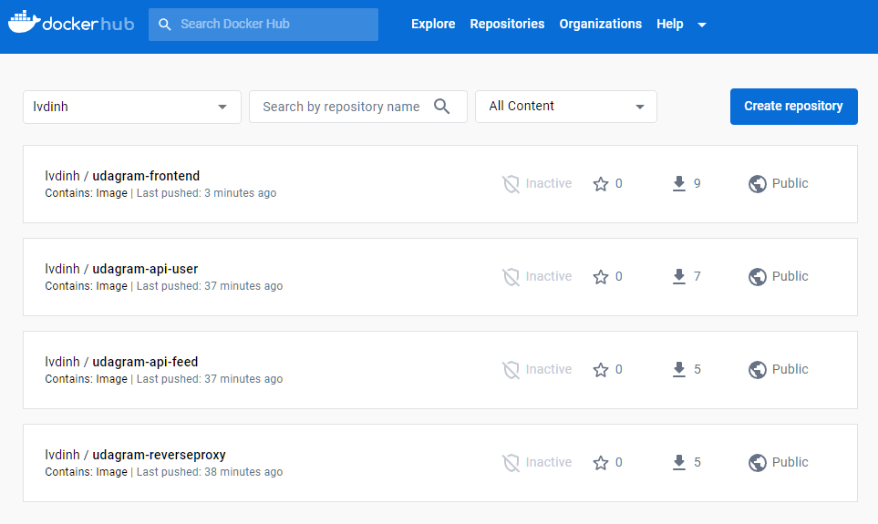
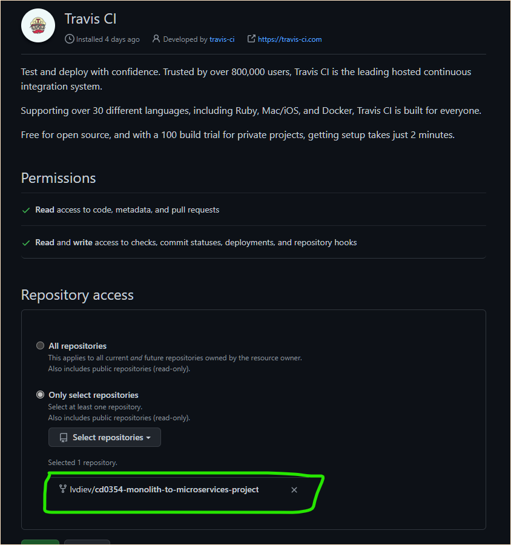
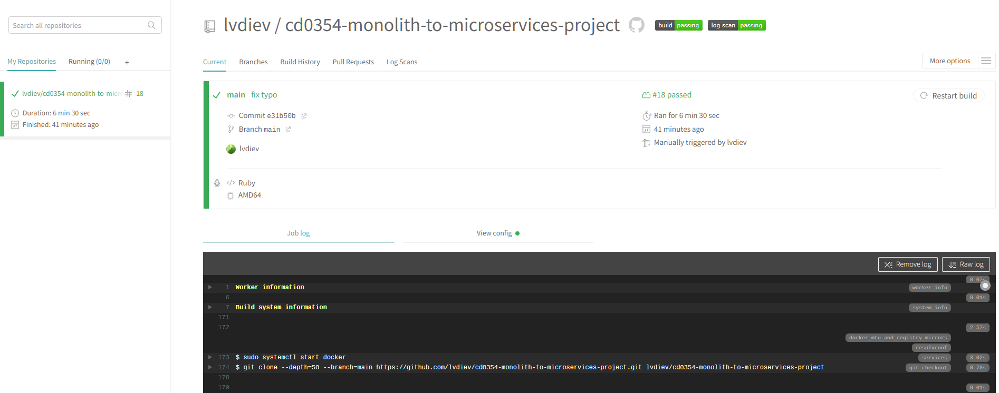
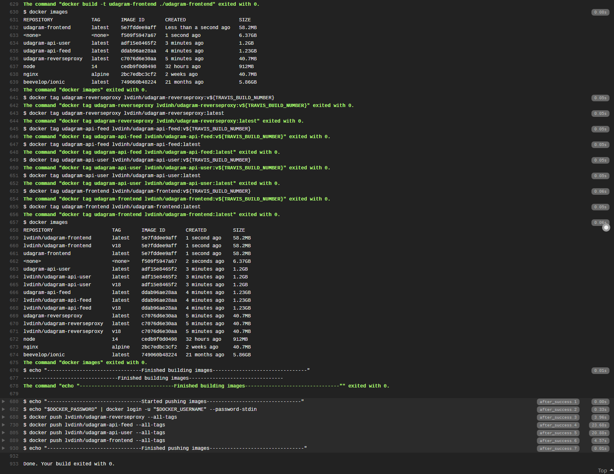
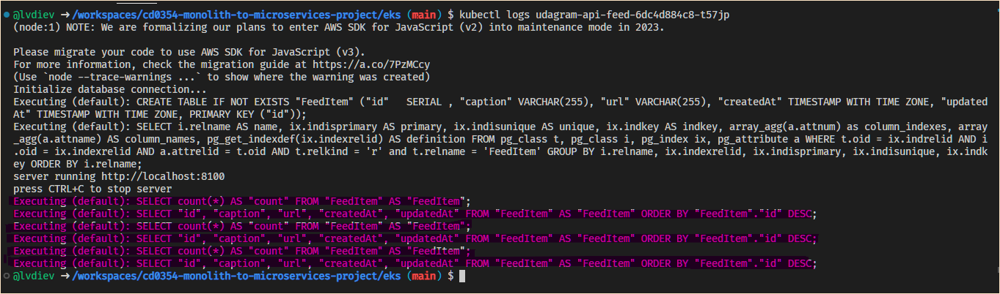
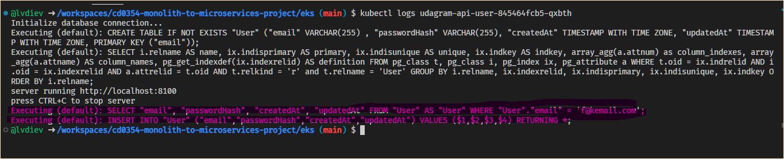

# Screenshots
To help review your infrastructure, please include the following screenshots in this directory::

## Deployment Pipeline
* DockerHub showing containers that you have pushed

    

* GitHub repository’s settings showing your Travis webhook (can be found in Settings - Webhook)

    

* Travis CI showing a successful build and deploy job

    

    Build logs

    

## Kubernetes
* To verify Kubernetes pods are deployed properly
    ```bash
    kubectl get pods
    ```
    

* To verify Kubernetes services are properly set up
    ```bash
    kubectl describe services
    ```
    
    
    
    
    
    
    

* To verify that you have horizontal scaling set against CPU usage
    ```bash
    kubectl describe hpa
    ```

    
    
    

* To verify that you have set up logging with a backend application
    ```bash
    kubectl logs {pod_name}
    ```
    
    
    
    

## Backend logs
* Feed API logs
    
* User API logs
    
